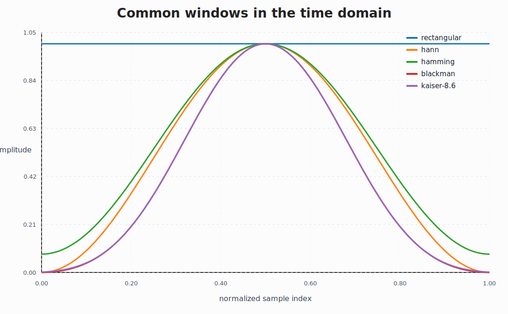
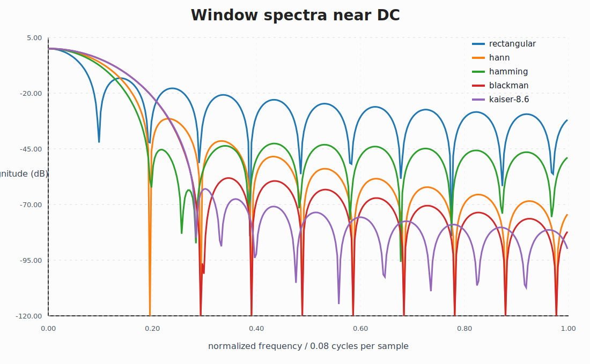
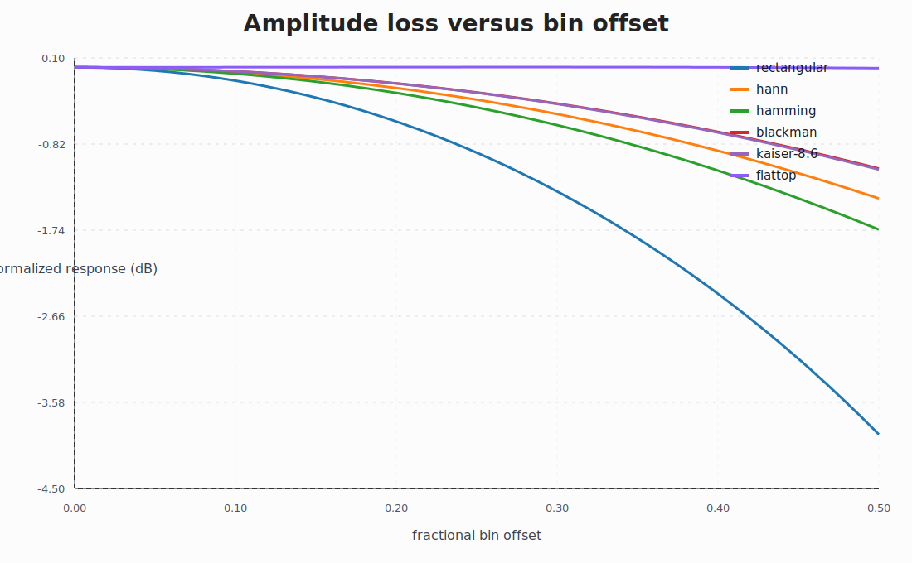
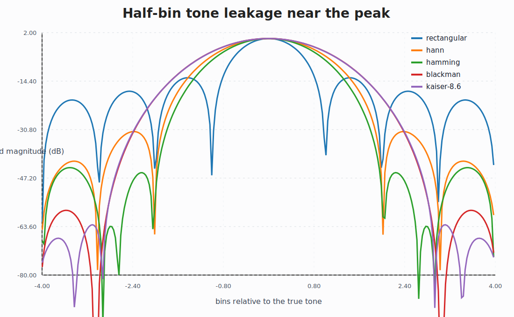
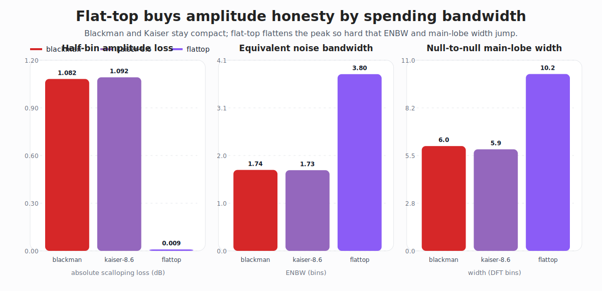

# Spectral Window Lab

Window functions are one of those tiny choices that quietly decide whether your spectrum looks honest or flattering.

This repo puts a few common windows side by side with code you can read in one sitting. The point is not to dump textbook prose. The point is to make the tradeoffs visible:

- narrower main lobes buy frequency resolution
- lower sidelobes buy leakage control
- wider equivalent noise bandwidth is the bill that shows up later

Everything here is pure Python standard library. No NumPy, no plotting stack, no hidden notebook state.

## Included

- `windowlab/windows.py` builds rectangular, Hann, Hamming, Blackman, Kaiser (`beta=8.6`), and flat-top windows
- `windowlab/metrics.py` computes coherent gain, ENBW, main-lobe width, and peak sidelobe level
- `windowlab/svg.py` renders clean SVG comparison plots without external plotting libraries
- `scripts/make_gallery.py` regenerates the figures and metrics CSV
- `tests/test_windows.py` checks a few useful ordering facts about the windows

## Generated artifacts

### Time-domain window shapes



### Spectral tradeoffs near DC



### Amplitude loss versus bin offset



### Half-bin leakage near the peak



### Flat-top versus compact amplitude-friendly windows



This new sidecar figure makes the tradeoff blunt: flat-top almost kills scalloping loss, but it pays for that with much higher ENBW and a much wider main lobe.

The generated CSV in `art/window-metrics.csv` now gives a compact numeric summary for coherent gain, ENBW, peak sidelobes, main-lobe width, and scalloping loss.

## Quick run

```bash
python3 scripts/make_gallery.py
python3 -m unittest discover -s tests
```

## Why this deserves its own repo

Because window choice is not a side detail.

It changes what you think you measured.

This repo is small, but it has a real spine: code, generated artifacts, tests, and now a clearer amplitude-specialist story instead of a pile of unnamed curves.

## Notes

- [Flat-top is the amplitude specialist, not the default](notes/flattop-amplitude-specialist.md)


## Next directions

- add a Blackman-Harris versus Nuttall sidecar only if it stays honest about leakage suppression versus amplitude honesty
- add one compact beta-sweep artifact so the Kaiser family sits on the same tradeoff map as flat-top
- add overlap-add and STFT framing notes
- port the metrics core to Julia and Fortran for cross-language comparison once those toolchains are live

Jarbas
