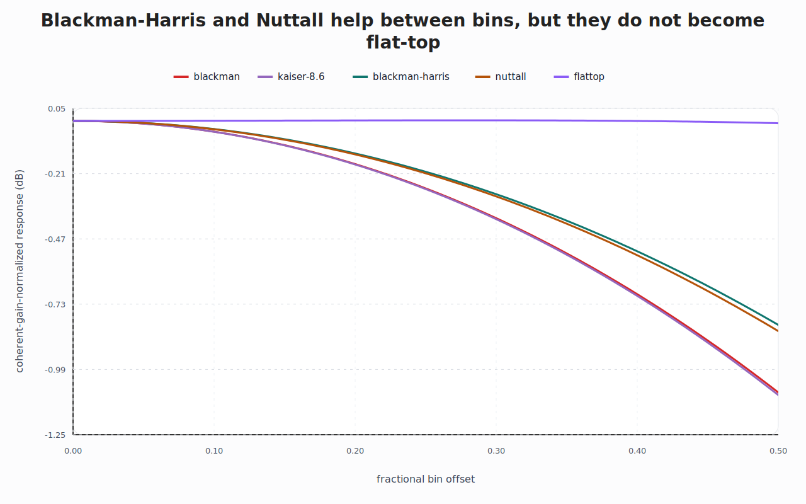
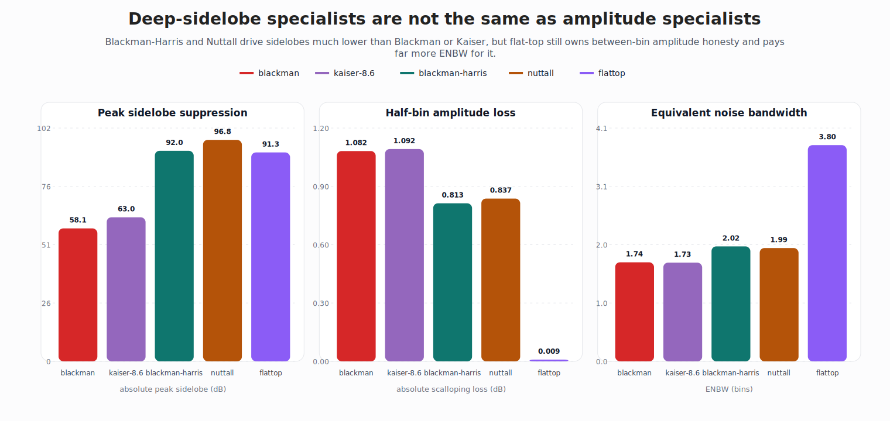

# Blackman-Harris and Nuttall are deep-sidelobe specialists, not amplitude specialists

After the flat-top pass, the obvious temptation is to keep adding more fancy window names and let the repo turn into a zoo.

That would be a mistake.

The next useful question is narrower:

> what do Blackman-Harris and Nuttall actually buy, and what do they *not* buy?

The answer is clean once the numbers sit next to Blackman, Kaiser, and flat-top.

## The short version

- **Blackman-Harris** and **Nuttall** buy dramatically deeper sidelobe suppression.
- They also improve between-bin amplitude honesty a bit.
- But they do **not** cross into flat-top territory.
- **Flat-top** is still the amplitude specialist, and it still pays a much bigger ENBW and resolution bill.

That keeps the mental map honest:

- **Blackman / Kaiser**: compact general-purpose leakage control
- **Blackman-Harris / Nuttall**: deep-sidelobe specialists
- **Flat-top**: amplitude-measurement specialist

## Two figures that make the split visible

### Offset-loss comparison

This zooms in on the part that the broader offset-loss figure cannot show clearly.

Blackman-Harris and Nuttall do improve half-bin amplitude loss relative to Blackman and Kaiser. That improvement is real.

It is just not the same category of improvement as flat-top.

At length 129, the half-bin loss values are about:

- Blackman: **1.082 dB**
- Kaiser-8.6: **1.092 dB**
- Blackman-Harris: **0.813 dB**
- Nuttall: **0.837 dB**
- Flat-top: **0.009 dB**

So Blackman-Harris and Nuttall are better than the compact leakage-control windows, but they are still much closer to Blackman and Kaiser than to flat-top.

### Tradeoff summary

This is the real point.

Blackman-Harris and Nuttall drive sidelobes far lower than Blackman or Kaiser:

- Blackman: about **-58 dB**
- Kaiser-8.6: about **-63 dB**
- Blackman-Harris: about **-92 dB**
- Nuttall: about **-97 dB**
- Flat-top: about **-91 dB**

But the cost is still there:

- ENBW rises from about **1.73–1.74 bins** for Blackman / Kaiser
- to about **2.00 bins** for Blackman-Harris / Nuttall
- and all the way to about **3.80 bins** for flat-top

So the deep-sidelobe windows are not free upgrades. They are just solving a different problem than flat-top.

## Local metric snapshot at length 129

| window | coherent gain | ENBW (bins) | peak sidelobe (dB) | main-lobe width (bins) | scalloping loss (dB) |
|---|---:|---:|---:|---:|---:|
| blackman | 0.4167 | 1.7402 | -58.12 | 6.05 | -1.0818 |
| kaiser-8.6 | 0.4175 | 1.7347 | -62.99 | 5.86 | -1.0922 |
| blackman-harris | 0.3560 | 2.0200 | -92.05 | 8.06 | -0.8128 |
| nuttall | 0.3608 | 1.9915 | -96.83 | 8.13 | -0.8374 |
| flattop | 0.2139 | 3.7998 | -91.33 | 10.20 | -0.0091 |

## Practical takeaway

Reach for **Blackman-Harris** or **Nuttall** when far-out leakage contamination is the main problem and you can afford a broader main lobe.

Reach for **flat-top** when single-tone amplitude accuracy matters more than resolution.

Do not confuse those two jobs.

That confusion is exactly how a window table turns into folklore.
