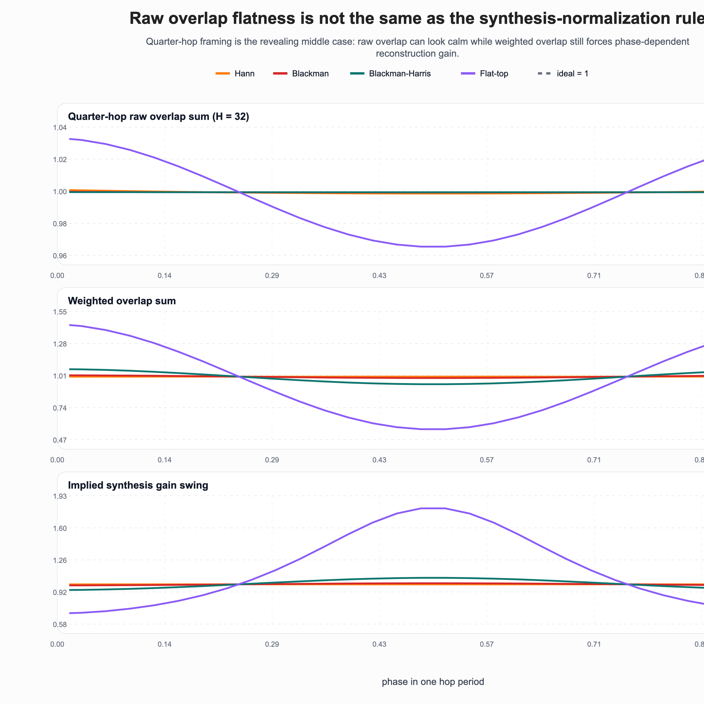

# Raw overlap flatness is not the synthesis rule

The first overlap-add sidecar asked a clean analysis question: if I slide the same window across time with hop `H`, how flat is the **raw sum**

```text
s[p] = Σ_k w[p + kH] ?
```

That matters for framing.
But it is not the whole reconstruction story.

If analysis and synthesis both use the same window, the quantity that multiplies the reconstructed signal before any normalization is

```text
d[p] = Σ_k w[p + kH]^2
```

That squared sum is the real local gain envelope.
If it ripples, a weighted overlap-add reconstruction has to divide by a phase-dependent number just to stay honest.



## Why this sidecar exists

The useful surprise is that the raw overlap sum can already look calm while the squared sum is still moving enough to matter.
So the rule for **analysis framing** is not automatically the rule for **analysis-plus-synthesis**.

This pass keeps the same scope as the earlier note:

- the repo's symmetric window tables
- frame length `N = 128`
- quarter-hop framing `H = 32`, which is the interesting middle case

Quarter hop is where the first sidecar already showed most windows settling down on the raw sum.
That is exactly why it is the right place to ask the second question.

## What changes once the window is squared

Representative rows from `art/window-synthesis-normalization-metrics.csv`:

- **Hann**: raw deviation `0.157%`, squared deviation `0.038%`
- **Blackman**: raw deviation `0.045%`, squared deviation `1.154%`
- **Blackman-Harris**: raw deviation `0.0053%`, squared deviation `6.417%`
- **flat-top**: raw deviation `3.571%`, squared deviation `44.511%`

That split is the real point.
Blackman-Harris looks almost perfectly calm if you only inspect the raw overlap sum at quarter hop.
But its squared overlap still moves enough that the implied synthesis normalization swings by about `1.12 dB` across hop phase.

Flat-top is harsher still.
Its squared overlap spans about `8.31 dB` at the same hop.
So flat-top is not just expensive on ENBW and still awkward on raw overlap-add; it is also expensive if you expect a calm weighted overlap-add denominator.

## The practical read

Three rules survive this pass:

1. **Raw overlap flatness is an analysis-side metric.**
   It tells you whether repeated framing quietly weights some sample phases more than others.
2. **The squared overlap sum is the synthesis-side metric.**
   If that one ripples, reconstruction needs a phase-dependent gain correction.
3. **Quarter hop is not one universal comfort zone.**
   Hann and Hamming are already very calm there, Blackman and Kaiser are usable but not perfectly tight, and Blackman-Harris / flat-top still carry a noticeably different synthesis bill.

So the repo's window story is now slightly sharper.
Leakage, scalloping loss, ENBW, raw overlap flatness, and synthesis normalization are related, but they are not the same question with different branding.

## Why this matters

A lot of window folklore quietly mixes these regimes together.
"Looks fine in the spectrum" is not the same as "frames cleanly," and "frames cleanly" is not the same as "reconstructs with a nearly constant weighted denominator."

That is why this repo keeps widening sideways instead of only redrawing the same FFT curves.
The window choice leaks into the rest of the signal chain.
